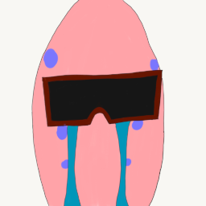

# code-name-gary
Code Name Gary

## Goals
 * Create a container orchestrator
 * control-plane vs worker node == no diferance for install/user.
 * single binary install
 * based on promise theory
 * HA on as few as 3 nodes and scale to millions of nodes (does not need tested at millions. but thousands would be cool)

## Non-goals
 * Service mesh
 * Other things 

## POC needs
 * [ClusterAPI](docs/cluster_api.md) app 
 * [Node Communication Interface](docs/nci.md)
 * [Node Communication implementation](docs/nanomsg.md)
 * [Container Runtime integration](docs/cri.md)

## Architecture

Based off promise Theory. designed to be control-plane-less. All nodes created equal. [info](docs/architecture.md)

## Community
Play nice with others please. [info](docs/community.md)

 
