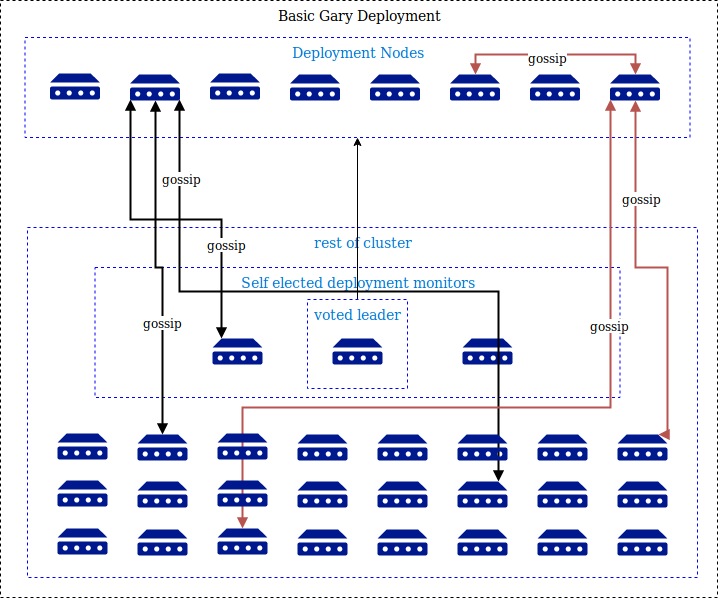

# Basic Cluster Architecture

## Node membership and failed node detection

Cluster membership and failed node detection will both be managed by a custom gossip/swim based algorithm to ensue quick, decentralized failure detection.

## Deployment Architecture

Each deployment will have a monitor group elected to ensure and maintain a healthy deployment. This group of machines can be part of many different detection groups.

Deployment configuration is done by yaml files, if you are familiar with kubernetes these files are being kept the same. The only divergence will be when we need more or less information then kubernetes.

Rough diagram:

